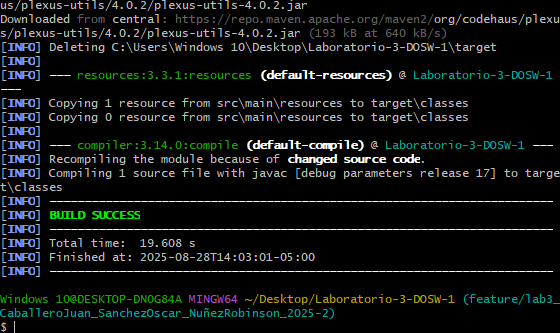
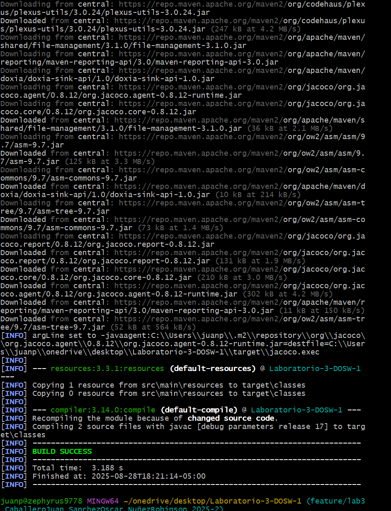

# 🧪 Laboratorio 3 - Pruebas de Software – Agilismo y Scrum – Análisis de Requerimientos

**Integrantes:**
- Oscar Andres Sanchez Porras.
- Juan Pablo Caballero Castellanos.
- Robinson Steven Nuñez Portela.

**Nombre De la Rama:**
`feature/lab3_CaballeroJuan_SanchezOscar_NuñezRobinson_2025-2`
---
## Pruebas de ejecución (Lab 3 parte 1), parte 1.
 
---
## Parte 2.

---
## ✅ Retos Completados
## Reto 1 ✅
### Descripción :
• Identifiquen reglas de negocio:

- El número de cuenta tiene que tener exactamente 10 dígitos.
- La cuenta es válida si los dos primeros dígitos corrresponden a un banco registrado, por ejemplo 01 BANCOLOMBIA, 02 DAVIVIENDA
- La cuenta no debe tener caracteres especiales ni letras.
- Las cuentas deben ser únicas en el sistema.
- Al momento de la creación de la cuenta el monto disponible se inicializa en cero.
- Los depositos deben ser positivos.
- Al  hacer un deposito a una cuenta no puede depositar si la cuenta no existe.

• Definan las funcionalidades principales:

- Crear una cuenta.
-  Permite validar que el número de la cuenta creada cumpla con las reglas del negocio.
- Permite verificar el saldo de una cuenta.
- Permite realizar depositos a cuentas existentes.
- Rechazar depositos que se hagan a cuentas inexistentes.

• Actores Principales:

Banco registrado: Son los usuarios que pueden crear cuentas, consultar salgo y Realizar depositos.
Abministrador del Sistema: Supervisa la información básica de las cuentas financieras, Abministra la gestion de cuentas financieras.
Clientes: Provee numeros de cuentas, Garantiza la cuenta este asegurada a un seguro de perdidas.

• Documenten las precondiciones necesarias para el sistema:

- El Sistema debe tener un conjunto de reglas y código limpio implementado SOLID.

- Se deben implementar pequeñas pruebas unitarias usando moks y stubs para asegurar que el código interno para el banco esté funcionando correctamente.

- Diseñamos el código y casos de uso UML para el usuario en su cuenta bancaria.

- Refactorizamos el código y volvemos a realizar las pruebas usando Junit.

- Se debe realizar una prueba E2E para comprobar el sistema en su conjunto y que se pueda validar escenarios e historias para el usuario y brindarle una buena app para que confié en los sistemas bancario.

---
## Historial de commits
e08c238 2025-08-28 | Parte 1 – Robinson Steven Nuñez Portela: Añadir historial de commits al README general | Robinson677  
908fef2 2025-08-28 | Parte 1 – Robinson Steven Nuñez Portela: Preguntas resueltas LAB03 | Robinson677  
7303049 2025-08-28 | Parte 1 - Juan Pablo Caballero: Estructura de carpetas | Juan Pablo Caballero  
ffa50aa 2025-08-28 | Parte 1 - Sanchez Oscar: Preparación del espacio de Trabajo | Oscar Sanchez  
d413ee9 2025-08-28 | Initial commit | Oscar Sanchez